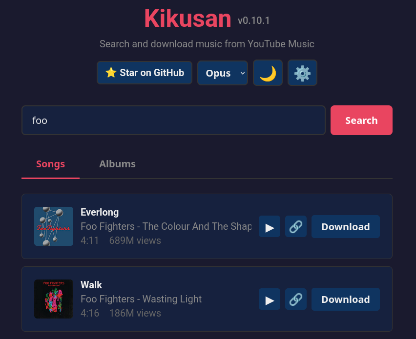

<div align="center">

# Kikusan

**Search, download and sync music from YouTube Music and other places (reddit, listenbrainz, billboard) with lyrics.**

[](https://github.com/RFLundgren/kikusan/releases)
[](https://github.com/RFLundgren/kikusan/blob/main/LICENSE)



</div>

> **Credit:** Kikusan was originally created by [dadav](https://github.com/dadav) — see the [original project](https://github.com/dadav/kikusan). This repository started as a fork and continues independently (the upstream project is archived), with the additional features listed in [What's New in This Fork](#whats-new-in-this-fork) below.

## Features

- **Search & Download**: Search YouTube Music and download audio in OPUS/MP3/FLAC format
- **Artist Browsing**: Search artists directly and browse their full discography (albums and singles, with pagination past YouTube Music's short preview)
- **Batch Downloads**: Select multiple tracks or albums in search results and queue them all in one action
- **Already-Downloaded Indicators**: Search results show whether a track is already downloaded, or was downloaded previously and later removed
- **Playlist Support**: Download entire playlists from YouTube Music, YouTube, and Deezer
- **Quick Download**: Search and download first match with a single command
- **Automatic Lyrics**: Fetch and embed synchronized lyrics from lrclib.net (LRC format)
- **Web Interface**: Modern web UI with search, download, theme toggle, and format selection
- **Download Queue Management**: Retry individual or all failed downloads, clear failed/completed jobs independently, and pause/resume the queue (in-progress downloads finish, queued ones wait)
- **Clean, Reliable Metadata**: Downloaded titles have video-descriptor suffixes and duplicate artist prefixes stripped automatically, and album/artist/year/track-number are taken from the reliable search/browse data rather than YouTube's often-inconsistent per-video metadata
- **Optional Lyrics**: Skip fetching lyrics entirely via a Settings toggle, if you don't want `.lrc` files
- **Docker Support**: Easy deployment with Docker and docker-compose
- **Plugin System**: Extensible architecture for custom music sources
- **Scheduled Sync**: Automated playlist monitoring with cron scheduling
- **M3U Playlists**: Automatic playlist file generation for downloads
- **Hooks**: Run custom commands when events occur (e.g., import playlists to Navidrome)
- **Retroactive Tagging**: Add lyrics and ReplayGain tags to existing audio files without re-downloading

## What's New in This Fork

This repository builds on [dadav/kikusan](https://github.com/dadav/kikusan) (now archived) with the following additions:

- **Artists tab**: Search for an artist by name and browse their full discography — the underlying fetch follows YouTube Music's pagination to return the complete list of albums/singles, not just the short preview shown on the artist page.
- **Batch selection & download**: Checkboxes on both the Songs and Albums tabs let you select several tracks or albums and queue them all with one "Download Selected" action, with "Select All"/"Deselect All" for large result sets (e.g. a 200-track playlist), instead of clicking Download individually.
- **Already-downloaded status on search results**: A badge next to each track shows whether it's already downloaded, or was downloaded before and the file has since been removed — backed by a lightweight index recorded on every successful download (single track, album, or playlist).
- **Download queue management**: A per-job "Retry" button for failed downloads, plus queue-wide "Retry All", "Clear Failed", and "Clear Completed" actions, and a "Pause"/"Resume" toggle that stops the queue from starting new downloads without interrupting one already in progress.
- **Album folder naming**: Album mode now organizes files as `Artist/Album (Year)/Track.ext` (matching Navidrome's expected layout) rather than `Artist/Year - Album/Track.ext`.
- **Clean titles**: Video-descriptor suffixes (`(Official Music Video)`, `(Official Audio)`, `[Lyric Video]`, etc.) and a duplicated artist prefix (e.g. `Rick Astley - Never Gonna Give You Up` → `Never Gonna Give You Up`) are stripped from the saved filename and tags — conservatively, so genuine info like `(Live)` or `(Remastered)` is left alone.
- **Reliable album/artist/year/track-number metadata**: YouTube's own per-video metadata is often inconsistent — one track in an album might report the right album/artist and another might not (or report it under a differently-named uploader channel), which used to split a single album or artist across multiple, wrongly-named folders and left tracks unsorted in players. These fields are now taken from the reliable search/browse data and forced onto both the output path and the embedded tags, so an album downloads into one consistently-named folder with correct track-order tags every time.
- **Skip Lyrics option**: A checkbox in Settings to skip fetching/embedding lyrics entirely, for anyone who doesn't want `.lrc` files.
- **Cookie freshness tracking**: An uploaded `cookies.txt` older than `KIKUSAN_COOKIE_MAX_AGE_HOURS` (default 30 days) is automatically treated as unconfigured rather than forced onto every request — a stale exported session can read as more suspicious to YouTube than an anonymous request, which previously caused every download to fail at once. The Settings UI also shows the file's age and flags it once stale.
- **Broader automatic cookie fallback**: `auto` cookie mode now also retries with cookies on YouTube's "Requested format is not available" error (a bot-detection symptom), not just literal sign-in-required messages.
- **PO Token provider support**: Age-restricted/bot-flagged videos can still fail with valid cookies alone, since YouTube also checks for a PO token. A `bgutil-ytdlp-pot-provider` sidecar is now included in `docker-compose.yml` by default and wired in via `KIKUSAN_POT_PROVIDER_URL`.
- **Browser impersonation**: yt-dlp now impersonates a real browser's network fingerprint by default (`KIKUSAN_BROWSER_IMPERSONATE`, via curl_cffi), since Google can force-rotate cookies the moment they're used from a mismatched fingerprint — which could invalidate a freshly exported cookies.txt on its very first use.
- **JS challenge solver runtime**: Deno is now installed in the Docker image so yt-dlp can actually decode signature/n-parameter obfuscated formats; previously the image had no JS runtime at all, silently degrading extraction quality.
- **Download Queue Pause/Resume**: A "Pause"/"Resume" toggle in the Download Queue header stops the queue from starting new downloads without interrupting one already in progress.
- **`KIKUSAN_ORGANIZATION_MODE` and `KIKUSAN_COOKIE_MODE` wired through `.env`** in the example `docker-compose.yml`, rather than requiring a compose-file edit to change them.
- **Bug fix**: albums containing bonus/preview tracks with no real video no longer fail the whole album — that one track is skipped instead.
- Assorted fixes: broadened the image proxy's allowed hosts so artist thumbnails and album art from `yt3.googleusercontent.com`/`gstatic.com` actually load, and kept the `publish.yml` workflow and Docker image pointed at this repository's own namespace.

## Usecase

I use navidrome as my music server. My music is stored on a NAS and mounted in the navidrome container as read-only.
Kikusan syncs my youtube music playlists on this shared mount and creates local m3u playlists. If kikusan has a discovery playlist configured (sync=True), songs that hav been removed from the upstream playlist are also removed from navidrome. There are some exceptions: They won't be removed if the songs are referenced by another playlist or starred in navidrome or in the `keep` playlist. Navidrome imports these playlist daily. Then I use [symfonium](https://play.google.com/store/apps/details?id=app.symfonik.music.player) to access my music via subsonic api.

## Plugin System

Kikusan supports plugins for syncing music from various sources beyond standard playlists:

**Built-in Plugins:**

- **`listenbrainz`** - Weekly recommendations from listenbrainz.org
  - Required: `user` (listenbrainz username)
  - Optional: `recommendation_type` (weekly-exploration, weekly-jams)

- **`rss`** - Generic RSS/Atom feed parser for music podcasts, blogs, etc.
  - Required: `url` (RSS/Atom feed URL)
  - Optional: `artist_field`, `title_field`, `timeout`, `user_agent`

- **`reddit`** - Fetch songs from music subreddits (r/listentothis, r/Music, r/IndieHeads, etc.)
  - Required: `subreddit` (subreddit name)
  - Optional: `sort` (hot/new/top/rising), `time_filter`, `limit`, `min_score`

- **`billboard`** - Fetch songs from Billboard charts (hot-100, pop-songs, etc.)
  - Required: `chart_name` (e.g., 'hot-100', 'pop-songs')
  - Optional: `date` (YYYY-MM-DD), `year` (for year-end charts), `limit`

**Usage:**

```bash
# List available plugins
kikusan plugins list

# Run a plugin once
kikusan plugins run listenbrainz --config '{"user": "myuser"}'
kikusan plugins run reddit --config '{"subreddit": "listentothis", "limit": 25}'
kikusan plugins run billboard --config '{"chart_name": "hot-100", "limit": 50}'

# Schedule in cron.yaml
# See cron.example.yaml for configuration examples
```

**Creating Third-Party Plugins:**

See [`examples/third-party-plugin/`](examples/third-party-plugin/) for a complete example of creating your own plugin. Plugins are distributed as Python packages and automatically discovered via entry points.

## Installation

Run from git:

```bash
git clone https://github.com/RFLundgren/kikusan
cd kikusan
uv sync
uv run kikusan --help
```

Install as uv tool:

```bash
uv tool install kikusan
kikusan --help
```

Or via [docker-compose](./docker-compose.yml).

## Usage

### CLI

```bash
# Search for music
kikusan search "Bohemian Rhapsody"

# Download by video ID
kikusan download bSnlKl_PoQU

# Download by URL
kikusan download --url "https://music.youtube.com/watch?v=bSnlKl_PoQU"

# Search and download first match
kikusan download --query "Bohemian Rhapsody Queen"

# Download entire playlist (YouTube Music, YouTube, or Deezer)
kikusan download --url "https://music.youtube.com/playlist?list=..."
kikusan download --url "https://www.deezer.com/playlist/..."

# Custom filename format
kikusan download bSnlKl_PoQU --filename "%(title)s"

# Options
kikusan download bSnlKl_PoQU --output ~/Music --format mp3
```

### Tag Existing Files

Add lyrics and ReplayGain tags to audio files you already have, without re-downloading:

```bash
# Tag all files in a directory (recursively)
kikusan tag /path/to/music

# Preview what would be done without making changes
kikusan tag --dry-run /path/to/music

# Only add lyrics (skip ReplayGain)
kikusan tag --no-replaygain /path/to/music

# Only add ReplayGain (skip lyrics)
kikusan tag --no-lyrics /path/to/music
```

**Features:**

- Recursively processes `.opus`, `.mp3`, `.flac` files
- Extracts metadata via mutagen (title, artist, album, duration)
- Fetches lyrics from lrclib.net using exact match, fuzzy search, and cleaned metadata retries
- Applies ReplayGain/R128 loudness normalization tags via rsgain
- Skips files that already have `.lrc` sidecar files (for lyrics)
- Skips files that already have ReplayGain tags (for ReplayGain)
- Non-fatal per-file errors with summary statistics
- Both lyrics and ReplayGain are enabled by default

**Requirements:**

- For ReplayGain: `rsgain` binary must be installed (included in Docker image)

### Web Interface

```bash
kikusan web
# Open http://localhost:8000
```

**Features:**

- Search YouTube Music with real-time results
- Download individual tracks with format selection (OPUS/MP3/FLAC)
- Dark/light theme toggle with automatic system preference detection
- View counts displayed for each track
- Responsive design for mobile and desktop

### Scheduled Sync (Cron)

Automatically monitor and sync playlists, plugins, and explore sources on a schedule:

```bash
# Run continuously with cron.yaml configuration
kikusan cron

# Run all syncs once and exit
kikusan cron --once

# Use custom config file
kikusan cron --config /path/to/cron.yaml
```

Create a `cron.yaml` file to configure:

- **Playlists**: YouTube Music, YouTube, or Deezer playlists
- **Plugins**: Listenbrainz, Reddit, Billboard, RSS feeds
- **Explore**: YouTube Music charts and mood/genre categories
- **Schedule**: Standard cron expressions (e.g., "0 9 \* \* \*" for daily at 9am)
- **Sync Mode**: Keep or delete files when removed from source

#### Explore Sources

Sync tracks from YouTube Music charts or mood/genre categories:

```yaml
explore:
  # Sync US music charts daily
  us-charts:
    type: charts
    country: US # ISO 3166-1 Alpha-2 code (ZZ = global)
    sync: true # Remove tracks that fall off the charts
    schedule: "0 6 * * *"
    limit: 10 # Optional: Only get top 10 songs from charts

  # Sync a mood/genre category weekly
  chill-vibes:
    type: mood
    params: "ggMPOg1uX1J" # Get params from: kikusan explore moods
    playlist_id: "RDCLAK5uy_..." # Optional: target specific playlist (get from explore mood-playlists)
    sync: false
    schedule: "0 12 * * 0"
```

Use `kikusan explore moods` to discover available mood/genre categories and their `params` values, and `kikusan explore charts --country XX` to preview chart contents.

See `cron.example.yaml` for detailed configuration examples.

### Notifications

Kikusan can send push notifications via [Gotify](https://gotify.net/) for scheduled sync operations:

- **Summary notifications only** - One notification per sync operation, not per track
- **Includes download/skip/fail counts** - See results at a glance
- **Optional** - Gracefully disabled if not configured
- **Non-blocking** - Notification failures don't stop downloads

**Setup:**

1. Install a Gotify server or use an existing instance
2. Create an application token in Gotify
3. Set environment variables:
   ```bash
   export GOTIFY_URL="https://push.example.com"
   export GOTIFY_TOKEN="your-app-token"
   ```

**Notifications are sent for:**

- Scheduled playlist syncs (via `kikusan cron`)
- Scheduled plugin syncs (via `kikusan cron`)
- Scheduled explore syncs (via `kikusan cron`)

Notifications are **not** sent for CLI operations or web UI downloads, as these are interactive and the user already sees the results.

### Navidrome Protection

Prevent deletion of songs during sync if they are starred or in a designated playlist in Navidrome:

**Features:**

- Protect songs starred/favorited in Navidrome (via Symfonium or other Subsonic clients)
- Protect songs in a designated "keep" playlist
- Real-time API checks during each sync operation
- Gracefully disabled if not configured
- Fails safe: keeps files if Navidrome is unreachable

**Setup:**

1. Configure environment variables:

   ```bash
   export NAVIDROME_URL="https://music.example.com"
   export NAVIDROME_USER="your-username"
   export NAVIDROME_PASSWORD="your-password"
   export NAVIDROME_KEEP_PLAYLIST="keep"  # optional, defaults to "keep"
   ```

2. Star songs in your Subsonic client (Symfonium, DSub, etc.) or add them to your "keep" playlist

3. When kikusan syncs playlists with `sync: true`, protected songs won't be deleted even if removed from the source playlist

**Behavior:**

- Checks both starred songs AND songs in the keep playlist
- Protected files are skipped during deletion with detailed logging
- Works alongside existing cross-playlist/plugin reference protection
- Minimal performance impact (~3 API calls per sync operation)

**Example workflow:**

1. Sync YouTube Music playlist with `sync: true`
2. Song gets removed from YouTube Music playlist
3. You've starred the song in Symfonium (synced to Navidrome)
4. Kikusan detects the star and keeps the file on disk
5. File remains available in Navidrome/Symfonium

### Hooks

Hooks allow you to run custom commands when certain events occur during sync operations. This is useful for integrating with external systems like Navidrome.

**Supported Events:**

- `playlist_updated`: Triggered when an M3U playlist is created or updated
- `sync_completed`: Triggered after every sync operation (success or failure)

**Configuration:**

Add a `hooks` section to your `cron.yaml`:

```yaml
hooks:
  # Import playlist to Navidrome when updated
  - event: playlist_updated
    command: |
      NAVIDROME_TOKEN=$(curl -s -X POST \
        -H "Content-Type: application/json" \
        -d "{\"username\": \"${NAVIDROME_USER}\", \"password\": \"${NAVIDROME_PASSWORD}\"}" \
        "${NAVIDROME_URL}/auth/login" | jq -r '.token')
      curl -X POST \
        -H "Content-Type: audio/x-mpegurl" \
        -H "X-ND-Authorization: Bearer ${NAVIDROME_TOKEN}" \
        --data-binary @"${KIKUSAN_PLAYLIST_PATH}" \
        "${NAVIDROME_URL}/api/playlist"
    timeout: 30  # seconds (default: 60)

  # Log sync results
  - event: sync_completed
    command: echo "Sync: ${KIKUSAN_PLAYLIST_NAME}" >> /var/log/sync.log
    run_on_error: true  # Run even if sync failed (default: false)
```

**Environment Variables:**

Hooks receive context via environment variables:

| Variable                | Description                                   |
| ----------------------- | --------------------------------------------- |
| `KIKUSAN_EVENT`         | Event type (playlist_updated, sync_completed) |
| `KIKUSAN_PLAYLIST_NAME` | Name of the playlist/plugin                   |
| `KIKUSAN_PLAYLIST_PATH` | Absolute path to the M3U file (if exists)     |
| `KIKUSAN_SYNC_TYPE`     | Type: "playlist", "plugin", or "explore"      |
| `KIKUSAN_DOWNLOADED`    | Number of tracks downloaded                   |
| `KIKUSAN_SKIPPED`       | Number of tracks skipped                      |
| `KIKUSAN_DELETED`       | Number of tracks deleted                      |
| `KIKUSAN_FAILED`        | Number of tracks that failed                  |
| `KIKUSAN_SUCCESS`       | "true" or "false"                             |

**Navidrome Integration Example:**

To automatically import playlists to Navidrome using its [playlist import API](https://github.com/navidrome/navidrome/pull/2273):

1. Set environment variables (these are already used for Navidrome Protection):

   ```bash
   export NAVIDROME_URL="https://music.example.com"
   export NAVIDROME_USER="your-username"
   export NAVIDROME_PASSWORD="your-password"
   ```

2. Add hook to `cron.yaml`:

   ```yaml
   hooks:
     - event: playlist_updated
       command: |
         NAVIDROME_TOKEN=$(curl -s -X POST \
           -H "Content-Type: application/json" \
           -d "{\"username\": \"${NAVIDROME_USER}\", \"password\": \"${NAVIDROME_PASSWORD}\"}" \
           "${NAVIDROME_URL}/auth/login" | jq -r '.token')
         curl -X POST \
           -H "Content-Type: audio/x-mpegurl" \
           -H "X-ND-Authorization: Bearer ${NAVIDROME_TOKEN}" \
           --data-binary @"${KIKUSAN_PLAYLIST_PATH}" \
           "${NAVIDROME_URL}/api/playlist"
   ```

   Note: This requires `jq` to be installed for parsing the JSON response.

### Docker

```bash
docker compose up -d
# Open http://localhost:8000
```

## Configuration

### Environment Variables

| Variable                             | Default                           | Description                                                     |
| ------------------------------------ | --------------------------------- | --------------------------------------------------------------- |
| `KIKUSAN_DOWNLOAD_DIR`               | `./downloads`                     | Download directory                                              |
| `KIKUSAN_AUDIO_FORMAT`               | `opus`                            | Audio format (opus, mp3, flac)                                  |
| `KIKUSAN_FILENAME_TEMPLATE`          | `%(artist,uploader)s - %(title)s` | Filename template (yt-dlp format)                               |
| `KIKUSAN_ORGANIZATION_MODE`          | `flat`                            | File organization mode (flat, album)                            |
| `KIKUSAN_USE_PRIMARY_ARTIST`         | `false`                           | Use primary artist for folders (true, false)                    |
| `KIKUSAN_WEB_PORT`                   | `8000`                            | Web server port                                                 |
| `KIKUSAN_WEB_PLAYLIST`               | `None`                            | M3U playlist name for web downloads (optional)                  |
| `KIKUSAN_CORS_ORIGINS`               | `*`                               | CORS allowed origins (comma-separated)                          |
| `KIKUSAN_COOKIE_MODE`                | `auto`                            | Cookie usage: auto, always, or never                            |
| `KIKUSAN_COOKIE_RETRY_DELAY`         | `1.0`                             | Delay in seconds before retrying with cookies                   |
| `KIKUSAN_COOKIE_MAX_AGE_HOURS`       | `720`                             | Treat an uploaded cookie file as unconfigured past this age (0 = never) |
| `KIKUSAN_LOG_COOKIE_USAGE`           | `true`                            | Log cookie usage statistics (true, false)                       |
| `KIKUSAN_POT_PROVIDER_URL`           | `None`                            | Base URL of a [bgutil-ytdlp-pot-provider](https://github.com/Brainicism/bgutil-ytdlp-pot-provider) server for PO tokens (optional, see below) |
| `KIKUSAN_BROWSER_IMPERSONATE`        | `chrome`                          | Browser to impersonate at the network level to avoid cookie "hijack" rotation (empty to disable, see below) |
| `GOTIFY_URL`                         | `None`                            | Gotify server URL for notifications (optional)                  |
| `GOTIFY_TOKEN`                       | `None`                            | Gotify application token (optional)                             |
| `NAVIDROME_URL`                      | `None`                            | Navidrome server URL for protection (optional)                  |
| `NAVIDROME_USER`                     | `None`                            | Navidrome username (optional)                                   |
| `NAVIDROME_PASSWORD`                 | `None`                            | Navidrome password (optional)                                   |
| `NAVIDROME_KEEP_PLAYLIST`            | `keep`                            | Playlist name for protection (optional)                         |
| `YT_DLP_COOKIE_FILE`                 | `None`                            | Path to cookies.txt file for yt-dlp (optional)                  |
| `KIKUSAN_MULTI_USER`                 | `false`                           | Enable per-user M3U playlists via `Remote-User` header          |
| `KIKUSAN_UNAVAILABLE_COOLDOWN_HOURS` | `168`                             | Hours to wait before retrying unavailable videos (0 = disabled) |

### Cookie Authentication

Kikusan supports two methods for providing cookies to yt-dlp:

1. **Web UI Upload** (Recommended):
   - Open the web UI
   - Click the settings icon (⚙️) in the header
   - Upload your cookies.txt file
   - The file is stored securely at `.kikusan/cookies.txt`

2. **Environment Variable**:
   ```bash
   export YT_DLP_COOKIE_FILE=/path/to/cookies.txt
   ```

**Priority**: Web-uploaded cookies take precedence over environment variable.

**Exporting Cookies**:

- Chrome/Edge: Install "Get cookies.txt LOCALLY" extension
- Firefox: Install "cookies.txt" extension
- Export from a browser profile you don't keep using afterward — YouTube rotates session tokens on active use, which invalidates an already-exported file within minutes
- Even a completely untouched export can be force-rotated the moment yt-dlp presents it from a different machine's network fingerprint than the browser it came from — see Browser Impersonation below, which mitigates this
- See [yt-dlp FAQ](https://github.com/yt-dlp/yt-dlp/wiki/FAQ#how-do-i-pass-cookies-to-yt-dlp) for detailed instructions

### PO Token Provider (age-restricted videos)

Even with valid, fresh cookies, YouTube can still strip audio formats from age-restricted or bot-flagged requests ("Requested format is not available"), because it also checks for a PO (Proof of Origin) token, not just cookies. The included `docker-compose.yml` runs a [bgutil-ytdlp-pot-provider](https://github.com/Brainicism/bgutil-ytdlp-pot-provider) sidecar for this by default — no setup needed beyond `docker compose up -d`.

- Configured via `KIKUSAN_POT_PROVIDER_URL` (default: `http://bgutil-pot-provider:4416`, matching the sidecar service name)
- Set it to an empty value in `.env` to disable if you're not running the sidecar
- If you're not using Docker, run the provider yourself (`docker run -d --init brainicism/bgutil-ytdlp-pot-provider`) and point `KIKUSAN_POT_PROVIDER_URL` at it

### Browser Impersonation (cookie "hijack" protection)

Google can force-rotate a session's cookies (`SID`/`SIDTS` family) the moment they're presented from a network/TLS fingerprint that doesn't match the browser they were issued to — which is exactly what happens when cookies are exported from your browser and then used by yt-dlp running on a server or in a container. This can invalidate a cookies.txt on its very first use, even if you never touched the browser again.

Kikusan mitigates this by having yt-dlp impersonate a real browser's network fingerprint (via [curl_cffi](https://github.com/lexiforest/curl_cffi)) for all requests, enabled by default.

- Configured via `KIKUSAN_BROWSER_IMPERSONATE` (default: `chrome`)
- Set it to an empty value in `.env` to disable
- Other supported values: `firefox`, `safari`, `edge` (see `yt-dlp --list-impersonate-targets` for the full list available in your image)

### File Organization

Kikusan supports two file organization modes:

#### Flat Mode (Default)

All files stored in the download directory with the filename template:

```
downloads/
├── Queen - Bohemian Rhapsody.opus
├── Pink Floyd - Comfortably Numb.opus
└── ...
```

#### Album Mode

Files organized by artist and album with automatic metadata extraction:

```
downloads/
├── Queen/
│   ├── 1975 - A Night at the Opera/
│   │   ├── 01 - Death on Two Legs.opus
│   │   ├── 11 - Bohemian Rhapsody.opus
│   │   └── 12 - God Save the Queen.opus
│   └── 1991 - Innuendo/
│       ├── 01 - Innuendo.opus
│       └── 06 - The Show Must Go On.opus
└── Pink Floyd/
    └── 1979 - The Wall/
        ├── 01 - In the Flesh.opus
        └── 26 - Outside the Wall.opus
```

**Enable album mode:**

```bash
export KIKUSAN_ORGANIZATION_MODE=album
```

**Behavior:**

- **Full metadata**: `Artist/Album (Year)/NN - Track.ext`
- **Missing track number**: `Artist/Album (Year)/Track.ext`
- **Missing album**: `Artist/Track.ext`
- **Path sanitization**: Invalid filesystem characters are automatically removed

**Multi-Artist Handling:**

By default, album mode uses the full artist string from metadata:

- `Queen feat. David Bowie` → folder: `Queen feat. David Bowie/`
- `Artist1, Artist2` → folder: `Artist1, Artist2/`

To use only the primary artist for cleaner folder organization:

```bash
export KIKUSAN_USE_PRIMARY_ARTIST=true
```

This extracts the main artist (before separators) for folder names:

- `Queen feat. David Bowie` → folder: `Queen/`
- `Artist1, Artist2` → folder: `Artist1/`
- `Artist & Guest` → folder: `Artist/`

Supported separators (in priority order): `feat.`, `ft.`, `featuring`, `with`, `&`, `, `

The full artist metadata is still preserved in the audio file tags.

**Notes:**

- Album mode is opt-in; flat mode remains the default for backward compatibility
- Primary artist extraction is optional (disabled by default)
- Existing files are not reorganized when switching modes
- New downloads will use the selected organization mode
- File existence checking works in both modes to prevent duplicates

### State Files & Playlists

Kikusan tracks downloaded files and generates M3U playlists automatically:

- **State Files**: Stored in `{download_dir}/.kikusan/state/` (for playlists) and `{download_dir}/.kikusan/plugin_state/` (for plugins)
- **M3U Playlists**: Generated at `{download_dir}/{name}.m3u` for each sync configuration

### Unavailable Video Cooldown

Kikusan automatically prevents repeated failed downloads of unavailable videos to reduce wasted bandwidth and API requests.

**How it works:**

When a video returns a "Video unavailable" error (distinct from authentication or network errors), Kikusan records the video ID with a timestamp in `{download_dir}/.kikusan/unavailable.json`. The video will be skipped during subsequent sync operations until the cooldown period expires.

### Filename Length Safety

Kikusan automatically truncates long filenames to prevent filesystem errors while preserving readability.

## CLI Reference

This section documents all CLI commands and their options.

### Global Options

These options apply to all commands:

| Option                   | Env Variable                            | Description                                                                     |
| ------------------------ | --------------------------------------- | ------------------------------------------------------------------------------- |
| `--cookie-mode`          | `KIKUSAN_COOKIE_MODE`                   | Cookie usage: `auto` (retry on auth errors), `always`, `never`. Default: `auto` |
| `--cookie-retry-delay`   | `KIKUSAN_COOKIE_RETRY_DELAY`            | Delay in seconds before retrying with cookies. Default: `1.0`                   |
| `--no-log-cookie-usage`  | (inverse of `KIKUSAN_LOG_COOKIE_USAGE`) | Disable logging of cookie usage statistics                                      |
| `--unavailable-cooldown` | `KIKUSAN_UNAVAILABLE_COOLDOWN_HOURS`    | Hours to wait before retrying unavailable videos (0 = disabled). Default: `168` |
| `--pot-provider-url`     | `KIKUSAN_POT_PROVIDER_URL`              | Base URL of a bgutil-ytdlp-pot-provider server for PO tokens. Unset by default  |
| `--browser-impersonate`  | `KIKUSAN_BROWSER_IMPERSONATE`           | Browser to impersonate at the network level (chrome, firefox, safari, etc). Default: `chrome` |
| `--version`              | -                                       | Show version and exit                                                           |

### kikusan search

Search for music on YouTube Music.

```bash
kikusan search "query" [OPTIONS]
```

| Option        | Description                             |
| ------------- | --------------------------------------- |
| `-l, --limit` | Maximum number of results (default: 10) |

### kikusan download

Download a track by video ID, URL, or search query.

```bash
kikusan download [VIDEO_ID] [OPTIONS]
```

| Option                                         | Env Variable                 | Description                                                           |
| ---------------------------------------------- | ---------------------------- | --------------------------------------------------------------------- |
| `-u, --url`                                    | -                            | YouTube, YouTube Music, or Deezer URL                                 |
| `-q, --query`                                  | -                            | Search query (downloads first match)                                  |
| `-o, --output`                                 | `KIKUSAN_DOWNLOAD_DIR`       | Output directory                                                      |
| `-f, --format`                                 | `KIKUSAN_AUDIO_FORMAT`       | Audio format: `opus`, `mp3`, `flac`. Default: `opus`                  |
| `-n, --filename`                               | `KIKUSAN_FILENAME_TEMPLATE`  | Filename template (yt-dlp format)                                     |
| `--no-lyrics`                                  | -                            | Skip fetching lyrics                                                  |
| `-p, --add-to-playlist`                        | -                            | Add downloaded track(s) to M3U playlist                               |
| `--organization-mode`                          | `KIKUSAN_ORGANIZATION_MODE`  | File organization: `flat` or `album`. Default: `flat`                 |
| `--use-primary-artist/--no-use-primary-artist` | `KIKUSAN_USE_PRIMARY_ARTIST` | Use only primary artist for folder names in album mode                |
| `--replaygain/--no-replaygain`                 | `KIKUSAN_REPLAYGAIN`         | Apply ReplayGain/R128 tags via rsgain. Default: enabled when flag set |

### kikusan tag

Tag existing audio files with lyrics and ReplayGain (no re-download).

```bash
kikusan tag DIRECTORY [OPTIONS]
```

| Option                         | Description                                             |
| ------------------------------ | ------------------------------------------------------- |
| `--lyrics/--no-lyrics`         | Fetch and save lyrics from lrclib.net. Default: enabled |
| `--replaygain/--no-replaygain` | Apply ReplayGain/R128 tags via rsgain. Default: enabled |
| `--dry-run`                    | Preview what would be done without making changes       |

**Notes:**

- Recursively processes `.opus`, `.mp3`, `.flac` files in the specified directory
- Skips files that already have `.lrc` sidecar files (for lyrics)
- Non-fatal errors: continues processing remaining files and reports summary statistics
- Requires `rsgain` binary for ReplayGain support (included in Docker image)

### kikusan web

Start the web interface.

```bash
kikusan web [OPTIONS]
```

| Option                                         | Env Variable                 | Description                                                 |
| ---------------------------------------------- | ---------------------------- | ----------------------------------------------------------- |
| `--host`                                       | -                            | Host to bind to. Default: `0.0.0.0`                         |
| `-p, --port`                                   | `KIKUSAN_WEB_PORT`           | Port to listen on. Default: `8000`                          |
| `-o, --output`                                 | `KIKUSAN_DOWNLOAD_DIR`       | Override download directory                                  |
| `--cors-origins`                               | `KIKUSAN_CORS_ORIGINS`       | CORS allowed origins (comma-separated or `*`). Default: `*` |
| `--web-playlist`                               | `KIKUSAN_WEB_PLAYLIST`       | M3U playlist name for web downloads (optional)              |
| `--multi-user/--no-multi-user`                 | `KIKUSAN_MULTI_USER`         | Per-user playlists via `Remote-User` header. Default: off   |
| `--organization-mode`                          | `KIKUSAN_ORGANIZATION_MODE`  | File organization: `flat` or `album`. Default: `flat`       |
| `--use-primary-artist/--no-use-primary-artist` | `KIKUSAN_USE_PRIMARY_ARTIST` | Use only primary artist for folder names in album mode      |

### kikusan cron

Run continuous sync based on cron.yaml (playlists, plugins, and explore sources).

```bash
kikusan cron [OPTIONS]
```

| Option                                         | Env Variable                 | Description                                            |
| ---------------------------------------------- | ---------------------------- | ------------------------------------------------------ |
| `-c, --config`                                 | -                            | Path to cron configuration file. Default: `cron.yaml`  |
| `-o, --output`                                 | `KIKUSAN_DOWNLOAD_DIR`       | Override download directory                            |
| `--once`                                       | -                            | Run all sync jobs once and exit (skip scheduling)      |
| `-f, --format`                                 | `KIKUSAN_AUDIO_FORMAT`       | Audio format: `opus`, `mp3`, `flac`. Default: `opus`   |
| `--organization-mode`                          | `KIKUSAN_ORGANIZATION_MODE`  | File organization: `flat` or `album`. Default: `flat`  |
| `--use-primary-artist/--no-use-primary-artist` | `KIKUSAN_USE_PRIMARY_ARTIST` | Use only primary artist for folder names in album mode |

### kikusan plugins list

List all available plugins.

```bash
kikusan plugins list
```

No options.

### kikusan plugins run

Run a plugin sync once (without cron.yaml).

```bash
kikusan plugins run PLUGIN_NAME --config '{"key": "value"}' [OPTIONS]
```

| Option                                         | Env Variable                 | Description                                            |
| ---------------------------------------------- | ---------------------------- | ------------------------------------------------------ |
| `-c, --config`                                 | -                            | Plugin config as JSON string (required)                |
| `-o, --output`                                 | `KIKUSAN_DOWNLOAD_DIR`       | Download directory                                     |
| `-f, --format`                                 | `KIKUSAN_AUDIO_FORMAT`       | Audio format: `opus`, `mp3`, `flac`. Default: `opus`   |
| `--organization-mode`                          | `KIKUSAN_ORGANIZATION_MODE`  | File organization: `flat` or `album`. Default: `flat`  |
| `--use-primary-artist/--no-use-primary-artist` | `KIKUSAN_USE_PRIMARY_ARTIST` | Use only primary artist for folder names in album mode |

## Authentication

kikusan does not use any kind of authentication. If you need to secure it, I suggest to use **Caddy** with **authelia**. This caddy config works for me:

```Caddy
(authelia_forwarder) {
  forward_auth http://192.168.1.10:9091 {
    uri /api/authz/forward-auth
    copy_headers Remote-User Remote-Groups Remote-Email Remote-Name
  }
}

kikusan.foobar.test {
  import authelia_forwarder
  reverse_proxy http://192.168.1.11:8007
}
```

### Multi-User Playlists

When running behind a reverse proxy with SSO (e.g. Authelia), kikusan can create separate M3U playlists per user by reading the `Remote-User` header. Each user's playlist is prefixed with their username (e.g. `alice-webplaylist.m3u`).

```bash
kikusan web --web-playlist webplaylist --multi-user
```

If the header is absent (e.g. direct access without the proxy), the shared playlist is used as fallback.

## Requirements

- Python 3.12+
- ffmpeg (for audio processing)

## Disclaimer

Kikusan is intended for **private, personal use only**.
It must not be used for commercial purposes or in any way that violates copyright laws.

Users are responsible for ensuring their usage complies with applicable laws and YouTubes terms of service.  
The developer does not condone copyright infringement and is not liable for misuse of this tool.

## LICENSE

[MIT](./LICENSE)
